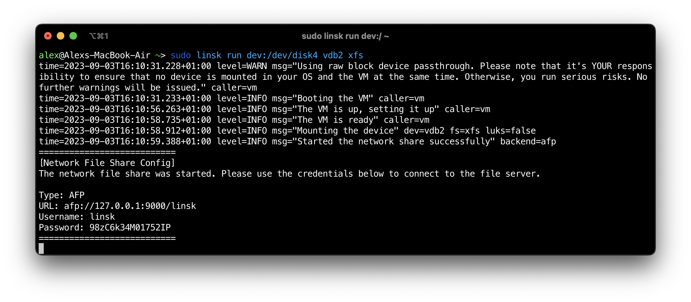

# Linsk - Apple Silicon Fork

**Linsk** is a utility that allows you to access Linux-native file system infrastructure, including LVM and LUKS on macOS. This fork includes fixes for Apple Silicon (M1/M2) Macs with improved memory allocation and timeout handling.

Linsk utilizes a lightweight Alpine Linux VM (~130 MB only) combined with network share technologies like AFP and FTP to expose Linux filesystems to macOS.



## 🍎 Apple Silicon Support

This fork includes specific fixes for Apple Silicon Macs:
- **Increased memory allocation** (2048MB recommended)
- **Extended timeouts** for VM boot and SSH setup
- **Optimized QEMU configuration** for aarch64

## 💻 Supported Platforms

- **macOS** (Intel and Apple Silicon)
- **CPU architectures**: x86_64 and aarch64 (Apple M1/M2)

## 📁 Network File Share Backends

- **AFP** - Default for macOS
- **FTP** - Alternative backend

## 💿 Installation

See [INSTALL_MACOS.md](INSTALL_MACOS.md) for detailed installation instructions.

## 🔧 Usage

See [USAGE_MACOS.md](USAGE_MACOS.md) for usage examples and Apple Silicon-specific commands.

## 🚀 Quick Start (Apple Silicon)

```bash
# Build the VM image with Apple Silicon optimizations
linsk build --vm-os-up-timeout 120 --vm-ssh-setup-timeout 180 --vm-mem-alloc 2048

# Access a USB device
sudo linsk run dev:/dev/disk4 vdb1 --vm-os-up-timeout 120 --vm-ssh-setup-timeout 180 --vm-mem-alloc 2048

# List available devices
sudo linsk ls dev:/dev/disk4
```

## ©️ License

GNU General Public License v3 - See [LICENSE](LICENSE) file.
